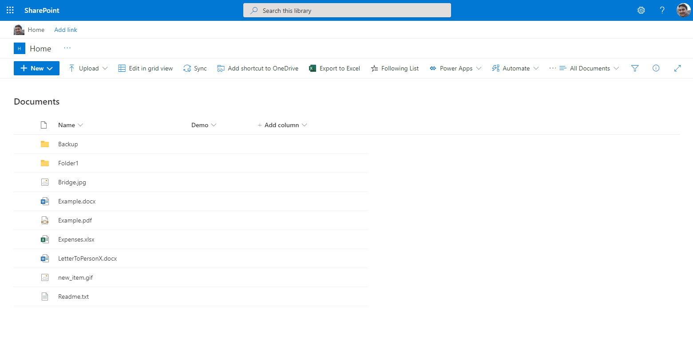

# follow-document-library

## Summary

This solution has the goal to easily identify/follow key documents from all Tenant and easily access them in Modern Pages. This solution uses the Out of Box Social feature **"Follow document"** with combination of MSGraph queries and MGT FileList/File components.

Usage of following Tecnologies:
- Usage of Social Feature **"Follow" documents** and associated REST "[/_api/social.following/](https://docs.microsoft.com/en-us/sharepoint/dev/general-development/how-to-follow-documents-sites-and-tags-by-using-the-rest-service-in-sharepoint-2)"
- Usage of MGT (Microsoft Graph Toolkit) [FileList](https://docs.microsoft.com/en-us/graph/toolkit/components/file-list) and [File](https://docs.microsoft.com/en-us/graph/toolkit/components/file)



## Used SharePoint Framework Version


## Applies to

- [SharePoint Framework](https://aka.ms/spfx)
- [Microsoft 365 tenant](https://docs.microsoft.com/en-us/sharepoint/dev/spfx/set-up-your-developer-tenant)


## Prerequisites

### Grant the service principal permission to the Microsoft Graph API

Once installed, the solution will request the required permissions via the **Office 365 admin portal > SharePoint > Advanced > API access**.
If you prefer to approve the permissions in advance, for example when testing the solution in the Workbench page without installing it, you can do so using the [CLI for Microsoft 365](https://pnp.github.io/cli-microsoft365/):

```bash
o365 spo login https://contoso-admin.sharepoint.com
o365 spo serviceprincipal grant add --resource 'Microsoft Graph' --scope 'Files.Read'
o365 spo serviceprincipal grant add --resource 'Microsoft Graph' --scope 'Files.Read.All'
o365 spo serviceprincipal grant add --resource 'Microsoft Graph' --scope 'Sites.Read.All'
```

## Solution

Solution|Author(s)
--------|---------
react-follow-document-library | [André Lage](http://aaclage.blogspot.com) ([@aaclage](https://twitter.com/aaclage))

## Version history

Version|Date|Comments
-------|----|--------
1.0|June 14, 2021|Initial release

## Disclaimer

**THIS CODE IS PROVIDED *AS IS* WITHOUT WARRANTY OF ANY KIND, EITHER EXPRESS OR IMPLIED, INCLUDING ANY IMPLIED WARRANTIES OF FITNESS FOR A PARTICULAR PURPOSE, MERCHANTABILITY, OR NON-INFRINGEMENT.**

---

## Minimal Path to Awesome

- Clone this repository
- Ensure that you are at the solution folder
- in the command-line run:
  - **npm install**
  - **gulp serve**
  - **gulp bundle --ship**
  - **gulp package-solution --ship**
  - Add to AppCatalog and deploy

## Features

Description of the extension that expands upon high-level summary above.

This extension illustrates the following concepts:

- Change of SharePoint Social Feature **"Follow"** to follow key Documents for users in Modern Sites. 
- Simple UX to manage **Followed** documents and report list followed documents across Tenant.
- Option to follow/unfollow documents individually. 
- Option to follow multiple document at same time.  
- Side Panel to List all users Followed Documents.


# Debug URL for testing
Here's a debug URL for testing around this sample.
```
?debugManifestsFile=https%3A%2F%2Flocalhost%3A4321%2Ftemp%2Fmanifests%2Ejs&loadSPFX=true&customActions=%7B"e56ac563-6d72-46f2-ba3d-68169f80fa7f"%3A%7B"location"%3A"ClientSideExtension%2EListViewCommandSet%2ECommandBar"%2C"properties"%3A%7B%7D%7D%7D
```


## Support

We do not support samples, but we do use GitHub to track issues and constantly want to improve these samples.

If you encounter any issues while using this sample, [create a new issue](https://github.com/pnp/sp-dev-fx-extensions/issues/new?assignees=&labels=Needs%3A+Triage+%3Amag%3A%2Ctype%3Abug-suspected&template=bug-report.yml&sample=react-follow-document-library&authors=@aaclage&title=react-follow-document-library%20-%20).

For questions regarding this sample, [create a new question](https://github.com/pnp/sp-dev-fx-extensions/issues/new?assignees=&labels=Needs%3A+Triage+%3Amag%3A%2Ctype%3Abug-suspected&template=question.yml&sample=react-follow-document-library&authors=@aaclage&title=react-follow-document-library%20-%20).

Finally, if you have an idea for improvement, [make a suggestion](https://github.com/pnp/sp-dev-fx-extensions/issues/new?assignees=&labels=Needs%3A+Triage+%3Amag%3A%2Ctype%3Abug-suspected&template=suggestion.yml&sample=react-follow-document-library&authors=@aaclage&title=react-follow-document-library%20-%20).


## References

- [Getting started with SharePoint Framework](https://docs.microsoft.com/en-us/sharepoint/dev/spfx/set-up-your-developer-tenant)
- [Building for Microsoft teams](https://docs.microsoft.com/en-us/sharepoint/dev/spfx/build-for-teams-overview)
- [Use Microsoft Graph in your solution](https://docs.microsoft.com/en-us/sharepoint/dev/spfx/web-parts/get-started/using-microsoft-graph-apis)
- [Publish SharePoint Framework applications to the Marketplace](https://docs.microsoft.com/en-us/sharepoint/dev/spfx/publish-to-marketplace-overview)
- [Microsoft 365 Patterns and Practices](https://aka.ms/m365pnp) - Guidance, tooling, samples and open-source controls for your Microsoft 365 development